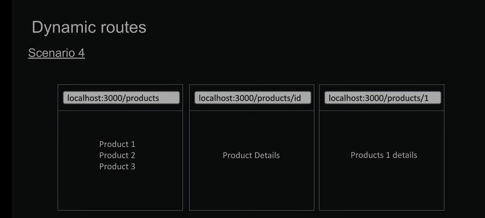

# React + Next.js Notes

Simple notes for my Next.js + React learning.

---

# 1. What is Next.js?

**Next.js is a React framework** used to build full websites and web applications.

React mainly helps us build UI/components.

Next.js gives React extra features like:

- Routing
- Server Components
- Data fetching
- SEO / Metadata
- API / Route Handlers
- Dynamic routes
- Image optimization
- Middleware / Proxy
- Easy deployment

Simple:

```text
React = UI library
Next.js = React + framework
```

---

# 2. Next.js Folder Structure

Main folder:

```text
src/
└── app/
```

The `app` folder is where we create routes/pages when using the App Router.

Example:

```text
src/
└── app/
    ├── page.jsx
    ├── about/
    │   └── page.jsx
    └── contact/
        └── page.jsx
```

This gives:

```text
/           → app/page.jsx
/about      → app/about/page.jsx
/contact    → app/contact/page.jsx
```

---

# 3. Important Next.js Folder/File Rules

### `page.jsx`

Creates a page/route.

```text
app/about/page.jsx
```

→ `/about`

### `layout.jsx`

Creates a shared layout around pages.

```text
app/layout.jsx
```

Usually contains things like:

- Navbar
- Footer
- Common layout

### `loading.jsx`

Shows loading UI while a route is loading.

### `error.jsx`

Used for handling errors in a route.

### `not-found.jsx`

Used for 404 / not found pages.

---

# 4. Route Groups

Folders inside `( )` are **Route Groups**.

Example:

```text
app/
└── (01.about)/
    └── about/
        └── page.jsx
```

The `(01.about)` does NOT appear in the URL.

So URL is:

```text
/about
```

not:

```text
/(01.about)/about
```

Route Groups are mainly useful for **organizing folders**.

---

# 5. Dynamic Routes

## Dynamic Routes

Dynamic Routes are used when we don't know the exact URL beforehand and a part of the URL needs to change based on data.

To create a Dynamic Route, use `[ ]` around the folder name.

Example:

```text
users/
└── [id]/
    └── page.jsx
```
Here, [id] is a Dynamic Segment.
```
It can handle different URLs:
/users/1
/users/2
/users/100
```
The value of id comes from the URL.

Remember

Dynamic Route = a route where a part of the URL can change.

[id] = Dynamic Segment

---

# 6. Link

For internal navigation:

```jsx
import Link from "next/link";

<Link href="/about">About</Link>
```

Use `Link` when you want the user to click and move to another page.

---

# 7. useRouter

For navigation using JavaScript:

```jsx
"use client";

import { useRouter } from "next/navigation";

const router = useRouter();

router.push("/about");
```

---

# 8. Server Component vs Client Component

In Next.js App Router, components are **Server Components by default**.

If you need:

- `useState`
- `useEffect`
- `onClick`
- `onChange`
- Browser APIs

use:

```jsx
"use client";
```

at the top of the file.

---
# 9. Catch all routes

Catch-All Routes are used when we want to catch multiple URL segments.

Use `[...name]` to create a Catch-All Route.

Example:
```
app/
└── article/
    └── [...article]/
        └── page.jsx
```
This can handle:
- `/article/hello-world`
- `/article/tech/news`
- `/article/tech/news/2025/01/01`

---
---
# 10. Redirect

Redirect is used to redirect the user to another page.

Example:
```jsx
import { redirect } from 'next/navigation'

export default function Redirect() {
  redirect('/home')
}
```
# 11. layout
Layout is used to create a common structure for all the pages
```For multiple pages header and footer are same which can be handled by "layout.js" file```
## Project Structure
```
/project-root
  /app
    /college
      layout.jsx
  /Components
    NavBar.jsx
    Footer.jsx
```
## layout.jsx
```
import React from "react";
import NavBar from "../../Components/NavBar";
import Footer from "../../Components/Footer";
const layout = ({ children }) => {
  return (
    <div>
      <NavBar />
      {children}
      <Footer />
    </div>
  );
};
```
---
# 12. Images

Next.js provides an `Image` component that optimizes images for better performance.

```
import Image from 'next/image'
const page = () => {
  return (
    <div className='h-screen w-screen'>
      <Image src="/Premanadji.jpg" alt="Premanadji" width={500} height={500} />
    </div>
  )
}

export default page
```

---
# 13. Client Side Fetching/Remdering
Client-Side Fetching/Rendering (CSR) means that the browser fetches the data and renders/updates the UI after the page has loaded, instead of Next.js generating the data on the server first.

---


# . React Topics I MUST Learn

Before going too deep into Next.js, learn these React concepts:

- JSX
- Components
- Props
- Events
- Conditional Rendering
- Lists and `map()`
- Forms
- `useState`
- `useEffect`
- `useRef`
- `useContext`
- Custom Hooks

---

# . Next.js Topics I MUST Learn

These are the important topics I should learn:

### Basics

- App Router
- Folder-based Routing
- `page.jsx`
- `layout.jsx`
- Route Groups
- Dynamic Routes
- `Link`
- `useRouter`

### Core Next.js

- Server Components
- Client Components
- Data Fetching
- Loading UI
- Error Handling
- `not-found`
- Metadata / SEO
- Images with `next/image`

### Backend

- Route Handlers / API
- Server Actions
- Database connection
- Authentication

### Advanced

- Middleware / Proxy
- Caching
- Revalidation
- Performance
- Deployment

---

# . Learning Order

I should learn in this order:

```text
React Basics
    ↓
Components
    ↓
Props + Events
    ↓
useState
    ↓
useEffect
    ↓
Forms
    ↓
Next.js Routing
    ↓
Layouts + Route Groups
    ↓
Dynamic Routes
    ↓
Server vs Client Components
    ↓
Data Fetching
    ↓
API / Route Handlers
    ↓
Authentication
    ↓
Database
    ↓
Deployment
```

---

# 12. My Notes

Add new things here as I learn:

## Topic:

### What I learned:

Write here...

### Example:

```jsx
// code here
```

### Important:

- Write important point here
